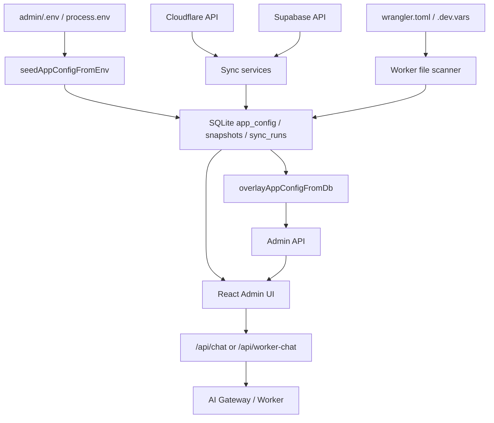

# 数据来源

[English](data-sources.md) | 简体中文

本文说明 Admin 界面与 API 中每一类数据的权威来源、缓存位置和刷新方式。当前实现的核心原则：

> **SQLite 管本地权威配置和同步记录；Cloudflare/Supabase 管远端资源真身；本地文件管 Worker 项目；SQLite 保存远端与文件快照，保证页面可恢复展示。**

更完整的本地存储、同步流程和冲突规则见 [本地存储与数据同步方案](./local-storage-sync.zh-CN.md)。

## 来源总览

| 来源类型 | 读取方式 | 典型数据 | 本地持久化 |
| --- | --- | --- | --- |
| SQLite | `src/db/*` | admin 用户、会话、`app_config`、同步记录、资源快照 | 权威或快照 |
| 环境变量 / `admin/.env` | `src/env.ts` 启动加载 | 首次默认值、bootstrap 配置 | 只 seed DB 缺失值 |
| Cloudflare API | `cf-resolve.ts`、`d1-sync.ts`、`cf-worker-resolve.ts` | AI Gateway、Provider、D1、线上 Worker | SQLite 快照 |
| Supabase API | `supabase-project-sync.ts` | Supabase 项目列表 | SQLite 快照 |
| 本地 TOML / vars | `worker-project-sync.ts`、`worker-runtime.ts` | Worker 项目、vars、D1 binding、dev secret 名称 | SQLite 索引和 hash |
| wrangler 子进程 | `wrangler.ts` | 部署、secret put/list、whoami | 同步事件 |
| 本地 TypeScript | `model-catalog.ts` | 内置模型目录（当前以 Qwen 为主） | 代码 |
| 浏览器 localStorage | 前端 only | `admin_token` | 浏览器 |

## 启动与配置覆盖

启动顺序：

1. `src/env.ts` 读取 `process.env` 和 `admin/.env`。
2. `initDatabase()` 初始化 SQLite schema 和迁移表。
3. `seedAppConfigFromEnv()` 只把 DB 缺失的配置从 env seed 到 `app_config`。
4. `overlayAppConfigFromDb()` 用 SQLite 覆盖运行时 `env`。

因此 `app_config` 是 Admin 配置的本地权威源，`.env` 是首次启动种子和兼容入口。后续保存配置应写 SQLite；已经存在于 DB 的 key 不会被 `.env` 覆盖。

## 同步元信息

所有缓存型资源响应会尽量带 `_sync`：

```json
{
  "_sync": {
    "source": "local_snapshot",
    "stale": false,
    "last_synced_at": 1783620000000,
    "error": null,
    "run_id": "..."
  }
}
```

同步端点：

| 端点 | 作用 |
| --- | --- |
| `GET /admin/sync/status` | 查看各 source/scope 最新同步结果 |
| `GET /admin/sync/runs/:id` | 查看单次同步 run 和 events |
| `POST /admin/sync/refresh` | 手动刷新 Cloudflare、Worker 文件或 Supabase 快照 |

支持 `refresh=1` 的读取端点会强制请求远端或重新扫描文件；失败时返回最近快照和错误信息，不清空旧数据。

## 按数据域说明

### 账号与默认值

| 字段 | 权威来源 | 本地行为 |
| --- | --- | --- |
| `account_id` | `app_config` / env `CF_ACCOUNT_ID` | DB 优先 |
| `has_api_token` | `app_config` / env `CF_API_TOKEN` | 只暴露布尔值 |
| `defaults.gateway` | Cloudflare snapshot + `CF_GATEWAY_ID` | `loadCfLists()` 读快照，可 `refresh=1` |
| `defaults.provider_slug` | Cloudflare snapshot + `PROVIDER_SLUG` | 匹配不到时返回 warning |
| `defaults.model` | `MODEL` | DB 优先 |

出现位置：`GET /admin/state`、`GET /config`。

### AI Gateway

| 字段 | 权威来源 | 快照表 |
| --- | --- | --- |
| `id`、`authentication`、`collect_logs`、`is_default` | Cloudflare | `cf_gateways` |

读取路径统一走 `loadCfLists()`：

- 有可用快照时先返回 SQLite。
- `refresh=1` 或测试场景会请求 Cloudflare 并 upsert 快照。
- Cloudflare 失败时保留旧快照，并在 `_sync.error` 和 `sync_events` 记录错误。

列表出现在 `GET /admin/state`、`GET /config`、网关页。

### Custom Provider

| 字段 | 权威来源 | 快照表 |
| --- | --- | --- |
| `id`、`slug`、`name`、`base_url`、`enable` | Cloudflare | `cf_providers` |

Provider 列表和 Gateway 列表一起由 `loadCfLists()` 刷新。`slug` 建唯一索引，用于路由预览和默认 provider 解析。

### BYOK Provider Config

| 字段 | 权威来源 | 快照表 |
| --- | --- | --- |
| `id`、`provider_slug`、`alias`、`default_config` | Cloudflare | `cf_provider_configs` |
| `secret` 明文 | 用户提交到 Cloudflare | 不入库 |

网关详情和 BYOK 页通过 `ai-gateway-sync.ts` 读取。创建、更新、删除成功后更新快照并写 `sync_events`；失败时不伪造本地成功状态。

### D1 Database

| 数据 | 权威来源 | 本地行为 |
| --- | --- | --- |
| D1 database 列表 | Cloudflare | `cf_d1_databases` 快照 |
| 创建 D1 database | Cloudflare | 创建成功后 upsert 快照 |
| Worker D1 binding | `wrangler.toml` | 写文件后扫描到 `worker_project_d1_bindings` |
| Migration 执行结果 | Cloudflare D1 / wrangler | 写 `sync_events` |

Cloudflare DB 页面使用独立左侧标签，`GET /admin/cloudflare-db/d1/databases?refresh=1` 可强刷远端 D1 列表。创建数据库、绑定 Worker、执行 migration 是拆开的状态，不会因为后一步失败而隐藏前一步成功结果。

### Worker 项目与部署状态

| 数据 | 权威来源 | 本地行为 |
| --- | --- | --- |
| 本地 Worker 项目列表 | `WORKER_ROOT` 下 `wrangler.toml` | `worker_projects` 索引 |
| Worker vars | `wrangler.toml [vars]` | `worker_project_vars` 快照 |
| Dev secrets | `.dev.vars` | 只保存 key 和 hash 到 `worker_project_secret_names` |
| D1 bindings | `wrangler.toml [[d1_databases]]` | `worker_project_d1_bindings` 快照 |
| 线上 Worker | Cloudflare | `cf_workers` 快照 |
| 自定义域 | Cloudflare | `cf_worker_domains` 快照 |

读取路径：

- `GET /admin/worker/workers` 扫描本地项目并更新 DB 索引。
- `GET /admin/worker/status?refresh=1` 刷新本地文件和线上 Worker 匹配状态。
- `GET /admin/worker/cf-deployed?refresh=1` 刷新 Cloudflare 已部署 Worker 快照。

文件写操作仍以文件为准：`PUT /admin/worker/config` 写 `wrangler.toml`，`PUT /admin/worker/devvars` 写 `.dev.vars`，成功后重新扫描更新 SQLite。

### Supabase OAuth 与项目

| 数据 | 权威来源 | 本地行为 |
| --- | --- | --- |
| OAuth token | Supabase OAuth | `oauth_tokens`，使用现有加密 helper |
| 旧 token 文件 | `.supabase-oauth.json` | 首次发现时迁移到 SQLite 并删除旧文件 |
| 项目列表 | Supabase Management API | `supabase_projects` 快照 |

`GET /admin/supabase/projects?refresh=1` 会刷新 Supabase 项目。API 临时失败时返回最近项目快照和同步错误。

### 模型目录

| 字段 | 来源 |
| --- | --- |
| `id`、`display_name`、`family`、`supports_thinking`、`notes` | `src/model-catalog.ts` |

模型目录不从 Cloudflare 或模型提供商自动拉取。当前内置目录以 Qwen 为主，更新说明或新增型号需要改代码并重新部署 Admin；这是当前实现限制，不是架构对模型厂商的要求。

### Playground 聊天

| 模式 | 来源 |
| --- | --- |
| 直连 Gateway | 浏览器请求 `/api/chat`，Admin 转发到 AI Gateway |
| 经 Worker | 浏览器请求 `/api/worker-chat`，Admin 转发到本地或线上 Worker |
| 网关/模型下拉 | `GET /config`，含本地快照和 `_sync` |

生产聊天应走已部署 Worker；Playground 仍是调试入口。

## 数据流简图



## 常见误解

| 误解 | 事实 |
| --- | --- |
| SQLite 会替代 Cloudflare 管资源 | Cloudflare 仍是远端资源权威，SQLite 只是快照和审计 |
| `.env` 每次启动都会覆盖 DB | `.env` 只 seed 缺失配置，DB 已有值优先 |
| 默认网关来自 CF `is_default` | 默认选择以配置和解析策略为准，`is_default` 主要用于展示 |
| 模型列表来自 CF | 来自本地 `model-catalog.ts` |
| `CF_API_TOKEN` 能部署 Worker | 部署仍需要 `CLOUDFLARE_API_TOKEN` 或 `wrangler login` |
| BYOK / Worker secret 明文存在 Admin 数据库 | 明文不入库，只保存存在状态、名称或 hash |
