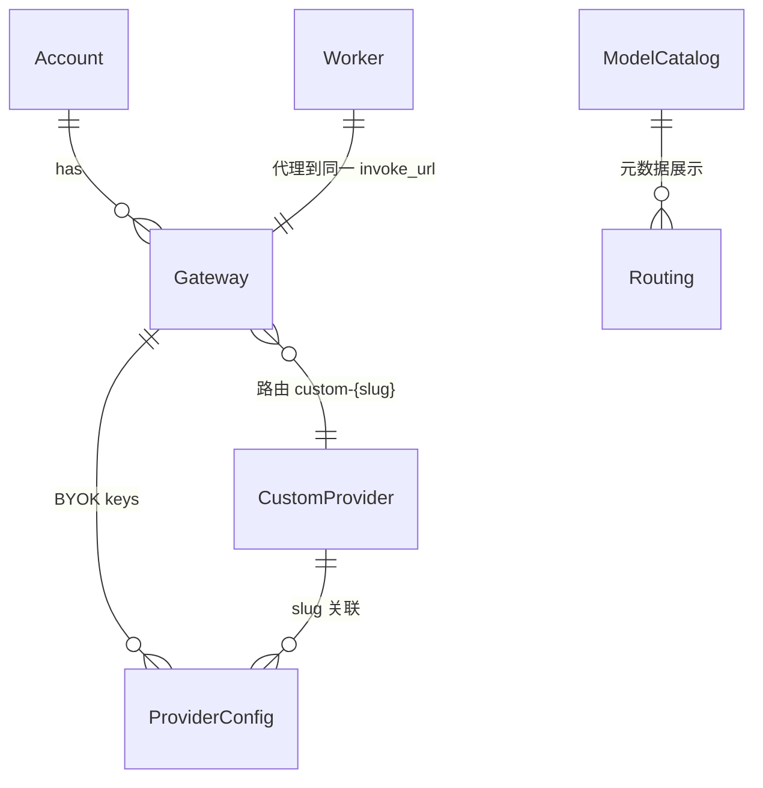

# 信息架构与功能交互

[English](information-architecture.md) | 简体中文

## 导航结构

侧边栏（`AppShell`）按**运维任务**划分，而非按 Cloudflare 控制台菜单镜像：

```
概览 ────────── 账号与默认路由总览
聊天调试 ────── 不部署 Worker 也能测模型
网关 ────────── CF AI Gateway 实例
提供商 ──────── 自定义模型上游（阿里云 MaaS 只是当前示例）
BYOK 密钥 ───── 网关级存储密钥（Secrets Store）
Worker 部署 ─── 边缘代理 wrangler 生命周期
设置 ────────── 仅管理前端 ADMIN_TOKEN
```

## 功能域与对象模型



| 对象 | 权威来源 | Admin 中的体现 |
|------|----------|----------------|
| 账号 | `.env` `CF_ACCOUNT_ID` | 概览、invoke_url 拼接 |
| 网关 | Cloudflare API | 网关页列表、详情 |
| 自定义提供商 | Cloudflare API | 提供商页、路由链中的 `provider` |
| BYOK 密钥 | CF Secrets Store（经 gateway provider_configs） | BYOK 页、网关详情 `keys` |
| 默认路由 | `.env` + 上述对象聚合 | 概览、Playground 初始选中 |
| 模型元数据 | 本地 `model-catalog.ts` | 模型卡片、Playground 侧栏 |
| Worker 配置 | 本地 `wrangler.toml` / `.dev.vars` | Worker 页 |

## 页面详解

### 概览 (`/`)

**目的**：一眼看清「当前默认配置 + 默认网关上下文 + Worker 是否就绪」。

| 数据块 | API | 交互 |
|--------|-----|------|
| 账号 / 默认值 | `GET /admin/state` | 只读；`defaults.*` 来自 env |
| 默认网关路由 | `GET /admin/gateways/{defaults.gateway}/context` | 展示 invoke_url、模型元数据、BYOK 数量 |
| Worker 状态 | `GET /admin/worker/status` | wrangler 版本、登录态、`[vars]` 摘要 |

**跳转**：可进入网关详情逻辑（与网关页共用 `GatewayDetailPanel`）。

---

### 聊天调试 (`/playground`)

**目的**：本地快速验证模型与网关；支持**直连 Gateway**与**经 Worker**两种路径。

| 操作 | API | 说明 |
|------|-----|------|
| 加载配置 | `GET /config` | 公开；网关/模型下拉、worker 运行时、`worker_routing` |
| 直连聊天 | `POST /api/chat` | SSE；需 `DASHSCOPE_API_KEY` |
| 经 Worker 聊天 | `POST /api/worker-chat` | SSE；需 Worker `SUPABASE_URL` + JWT（测试账号或粘贴 token） |
| Worker 健康检查 | `GET /api/worker-chat/health?target=local\|online` | 探测本地 `:8788` 或线上 workers.dev |
| 启动本地 Worker | `POST /admin/worker/dev/start` | 需 ADMIN_TOKEN；spawn `wrangler dev` |
| Supabase 配置 | `/admin/supabase/*` | OAuth → 选项目 → 保存测试账号（见下） |

**顶栏控件（经 Worker 时第二行）**

| 控件 | 作用 |
|------|------|
| 本地 / 线上 Worker | `worker_target`：`:8788` 或 CF 解析的 workers.dev |
| Worker 配置 / 调试界面 | 网关与模型取自 wrangler `[vars]` 或界面 CF 默认 |
| 启动本地 Worker | 本地未就绪时一键 `wrangler dev` |

**侧栏（经 Worker）**

1. Worker 目标与健康检查（置顶）
2. 数据来源摘要
3. Supabase 配置向导（① OAuth ② 应用项目 ③ 测试账号）
4. 路由链（Worker vars 或 CF 对照）

**Supabase 向导前提**：`admin/.env` 配置 `SUPABASE_OAUTH_*`；`ADMIN_BIND` 为回环；浏览器用 `http://localhost:5173` 打开（与 `ADMIN_WEB_ORIGIN` 一致）。测试邮箱/密码仅通过 `GET /admin/supabase/status` 返回，**不在**公开 `GET /config` 中暴露。

**与生产路径对齐**：经 Worker 时 Admin 代持 Supabase JWT 转发到 Worker，再经 AI Gateway 到所选模型提供商。

---

### 网关 (`/gateways`)

**目的**：管理 CF AI Gateway 实例，查看单网关完整上下文。

| 操作 | API |
|------|-----|
| 列表 | `GET /admin/state` → `gateways` |
| 详情 | `GET /admin/gateways/:id/context` |
| 创建/更新鉴权开关 | `POST /admin/gateways` `{ id, authentication? }` |
| 删除 | `DELETE /admin/gateways?id=` |

详情面板聚合：**网关属性** + **路由链** + **BYOK 列表** + **模型元数据**。点「详情」按钮打开侧栏（非行点击）。

Cloudflare 内置 `default` 网关会显示 `default` 标签，但**默认选中**仍由 `.env` 的 `CF_GATEWAY_ID` 决定。

---

### 提供商 (`/providers`)

**目的**：管理自定义上游（`custom-{slug}` 段对应的提供商）。

| 操作 | API |
|------|-----|
| 列表 | `GET /admin/state` → `providers` |
| 创建/更新 | `POST /admin/providers` |
| 删除 | `DELETE /admin/providers?id=` |

变更后，网关详情中的 `routing.provider` 与 `invoke_url` 会在下次拉取 context 时更新。

---

### BYOK 密钥 (`/keys`)

**目的**：（可选）为指定网关绑定 Secrets Store 中的提供商密钥（BYOK）。当前直连 Playground 仍使用 `.env` 的 `DASHSCOPE_API_KEY` 作为内置适配凭据；这是实现限制，不是 BYOK 架构对供应商的要求。

| 操作 | API |
|------|-----|
| 选网关 | `GET /admin/state` |
| 列密钥 | `GET /admin/keys?gateway=` |
| 路由上下文 | `GET /admin/gateways/:id/context`（显示 effective slug） |
| 添加 | `POST /admin/keys` |
| 删除 | `DELETE /admin/keys?gateway=&id=` |

密钥值**只写入** Cloudflare，Admin 不回显 secret 明文。

---

### Worker 部署 (`/worker`)

**目的**：在**运行 Admin 的机器**上管理 worker 项目并部署到 Cloudflare Workers。

| 操作 | API |
|------|-----|
| 选项目 | `GET /admin/worker/workers` |
| 状态 | `GET /admin/worker/status?dir=`（含 CF 已部署 vars 对照） |
| 生产 secret 名 | `GET /admin/worker/secrets?dir=` |
| CF 已部署列表 | `GET /admin/worker/cf-deployed` |
| 改 `[vars]` | `PUT /admin/worker/config?dir=` |
| 写本地 `.dev.vars` | `PUT /admin/worker/devvars?dir=` |
| 推生产 secret | `POST /admin/worker/secret?dir=` |
| 部署 | `POST /admin/worker/deploy?dir=`（SSE 日志） |

与网关页**无直接 API 耦合**；逻辑关联是 Worker 的 `CF_GATEWAY_ID`、`PROVIDER_SLUG` 应与 `.env` 一致，且 `DEFAULT_MODEL` 会出现在网关 context 的 `routing.worker_model`。

---

### 设置 (`/settings`)

**目的**：配置浏览器侧的 `ADMIN_TOKEN`（存入 `localStorage`）。

不调用后端；令牌须与服务器 `.env` 中 `ADMIN_TOKEN` 一致，否则管理页 API 返回 401。

## 典型用户流

### 首次配置

```
1. .env 填写 CF_ACCOUNT_ID、CF_API_TOKEN、CF_GATEWAY_ID、PROVIDER_*、ADMIN_TOKEN
2. pnpm dev → 设置页填入 ADMIN_TOKEN
3. 概览确认 state 无 gateways_error
4. 若无网关/提供商 → 网关页 / 提供商页创建（或运行仓库根 setup.sh）
5. （可选）BYOK 页绑定所选提供商密钥；当前内置直连适配也可在 `.env` 配置 `DASHSCOPE_API_KEY`
6. Playground 验证聊天（直连或经 Worker）
7. Worker 页部署边缘代理；Playground 可一键本地 `wrangler dev`
```

### 排查 401 / 路由错误

```
概览 / 网关详情 → 看 invoke_url、authentication、keys
提供商页 → 确认 slug、base_url、enable
.env → CF_GATEWAY_ID 是否与目标网关一致（勿用 CF 内置 default）
Playground → 换网关下拉对比
```

### 变更默认模型

| 场景 | 改哪里 |
|------|--------|
| Playground / 路由展示默认 | `.env` `MODEL` |
| Worker 生产默认 | Worker 页改 `DEFAULT_MODEL` 或 `wrangler.toml` |
| 模型说明卡片 | `src/model-catalog.ts`（仅展示，不影响路由） |

## 页面 ↔ API 速查

| 页面 | 需 ADMIN_TOKEN | 主要端点 |
|------|----------------|----------|
| 概览 | 是 | `/admin/state`, `/admin/gateways/:id/context`, `/admin/worker/status` |
| 聊天调试 | 部分 | `/config`, `/api/chat`, `/api/worker-chat`；Supabase/启动 dev 需令牌 |
| 网关 | 是 | `/admin/state`, `/admin/gateways/*` |
| 提供商 | 是 | `/admin/state`, `/admin/providers` |
| BYOK 密钥 | 是 | `/admin/state`, `/admin/keys`, `/admin/gateways/:id/context` |
| Worker 部署 | 是 | `/admin/worker/*` |
| 设置 | — | （无） |

## 组件复用

| 组件 | 使用页面 |
|------|----------|
| `GatewayDetailPanel` | 概览、网关 |
| `ModelDetailCard` | 概览、网关详情、Playground |
| `InvokeUrlCopy` | 网关详情、Playground |
| `RoutingWarnings` | 网关详情（env 与 CF 不一致时提示） |
